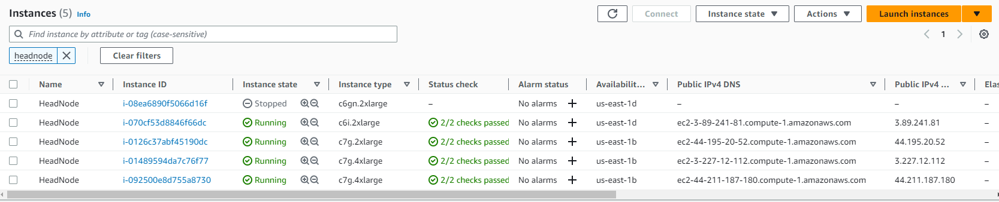

# Getting started with HPC on Graviton instances
* [Introduction](#introduction)
* [Summary of the recommended configuration](#summary-of-the-recommended-configuration)
* [Instructions for setting up the HPC cluster for best performance](#instructions-for-setting-up-the-hpc-cluster-for-best-performance)
  * [Compilers](#compilers)
  * [Computation libraries](#computation-libraries)
  * [EFA support](#efa-support)
  * [Open MPI](#open-mpi)
* [Running HPC applications](#running-hpc-applications)
  * [HPC packages](#hpc-packages)
  * [WRF](#wrf)
  * [OpenFOAM](#openfoam)
  * [Gromacs](#gromacs)
* [MPI application profiling](#mpi-application-profiling)
* [Appendix](#appendix)

## Introduction
[C7gn/Hpc7g](https://aws.amazon.com/blogs/aws/new-amazon-ec2-instance-types-in-the-works-c7gn-r7iz-and-hpc7g) instances are the latest additions to Graviton based EC2 instances, optimized for network and compute intensive High-Performance Computing (HPC) applications. This document is aimed to help HPC users get the optimal performance on Graviton instances. It covers the recommended compilers, libraries, and runtime configurations for building and running HPC applications. Along with the recommended software configuration, the document also provides example scripts to get started with 3 widely used open-source HPC applications: Weather Research and Forecasting (WRF), Open Source Field Operation And Manipulation (OpenFOAM) and Gromacs.

## Summary of the recommended configuration
Instance type: C7gn and HPC7g (Graviton3E processor, max 200 Gbps network bandwidth, 2 GB RAM/vCPU)

Cluster manager: AWS ParallelCluster
* Base AMI: aws-parallelcluster-3.5.1-ubuntu-2004-lts-hvm-arm64
* Operating System: Ubuntu 20.04 (The latest version supported by Parallel Cluster)
* Linux Kernel: 5.15 & later (for users intended to use custom AMIs)

ENA driver: version 2.8.3 & later (Enhanced networking)

EFA driver: version 1.23.0 & later ([docs.aws.amazon.coml#efa-start-enable](https://docs.aws.amazon.com/AWSEC2/latest/UserGuide/efa-start.html#efa-start-enable))

Compiler: Arm Compiler for Linux (ACfL) v23.04 & later ([see below for other compiler options](#list-of-hpc-compilers-for-graviton))

ArmPL: v23.04 & later (included in the ACfL compiler)

MPI: Open MPI v4.1.4 & later (the latest official release)

## Instructions for setting up the HPC cluster for best performance
We recommend using [AWS ParallelCluster](https://docs.aws.amazon.com/parallelcluster/latest/ug/what-is-aws-parallelcluster.html) (previously known as [CfnCluster](http://cfncluster.readthedocs.io)) to deploy and manage HPC clusters  on AWS EC2. AWS ParallelCluster 3.5.1 is a tool that can automatically set up the required compute resources, job scheduler, and shared filesystem commonly needed to run HPC applications. This section covers step-by-step instructions on how to set up or upgrade the tools and software packages to the recommended versions on a new ParallelCluster. Please refer to the individual sub-sections if you need to update certain software package on an existing cluster. For a new cluster setup, you can use [this template](scripts-setup/hpc7g-ubuntu2004-useast1.yaml) and replace the subnet, S3 bucket name for [custom action script](scripts-setup/install-gcc-11.sh), and ssh key information from your account to create a Ubuntu 20.04 cluster. The command to create a new cluster is
```
pcluster create-cluster --cluster-name test-cluster --cluster-configuration hpc7g-ubuntu2004-useast1.yaml
```
The cluster creation process takes about 10 minutes. You can find headNode information under the EC2 console page once the creation process is finished (see the image below). In the case that you have multiple headNodes under the account, you can go to instance summary and check `Instance profile arn` attribute to find out which one has a prefix matching the cluster-name you created.



Alternatively, you can also use `pcluster describe-cluster --cluster-name test-cluster` to find the instanceId of the headNode and `aws ec2 describe-instances --instance-ids <instanceId>` to find the public Ip.
```
{
  "creationTime": "2023-04-19T12:56:19.079Z",
  "headNode": {
    "launchTime": "2023-05-09T14:17:39.000Z",
    "instanceId": "i-01489594da7c76f77",
    "publicIpAddress": "3.227.12.112",
    "instanceType": "c7g.4xlarge",
    "state": "running",
    "privateIpAddress": "10.0.1.55"
  },
  "version": "3.5.1",
  ...
}
```

You can log in to the headNode in the same way as a regular EC2 instance. Run the [setup script](scripts-setup/install-tools-headnode-ubuntu2004.sh) with command `./scripts-setup/install-tools-headnode-ubuntu2004.sh` to install the required tools and packages (ACfL and Open MPI) on the shared storage, `/shared`.

### Compilers
Many HPC applications depend on compiler optimizations for better performance. We recommend using [Arm Compiler for Linux (ACfL)](https://developer.arm.com/Tools%20and%20Software/Arm%20Compiler%20for%20Linux) because it is tailored for HPC codes and comes with Arm Performance Libraries (ArmPL), which includes optimized BLAS, LAPACK, FFT and math libraries. Follow the below instructions to install and use ACfL 23.04 (latest version as of Apr 2023) or run the installation script with command `./scripts-setup/0-install-acfl.sh`.
```
# Install environment modules
sudo apt install environment-modules
source /etc/profile.d/modules.sh

# Find the download link to Arm compiler for your OS on https://developer.arm.com/downloads/-/arm-compiler-for-linux
mkdir -p /shared/tools && cd /shared/tools
wget -O arm-compiler-for-linux_23.04_Ubuntu-20.04_aarch64.tar <link to the tar ball>
tar xf arm-compiler-for-linux_23.04_Ubuntu-20.04_aarch64.tar

./arm-compiler-for-linux_23.04_Ubuntu-20.04/arm-compiler-for-linux_23.04_Ubuntu-20.04.sh \
-i /shared/arm -a --force

# load the module to use Arm Compiler for Linux (ACfL)
module use /shared/arm/modulefiles
module load acfl
```
You will see the following message if ACfL installation is successful.
```
Unpacking...
Installing...The installed packages contain modulefiles under /shared/arm/modulefiles
You can add these to your environment by running:
                $ module use /shared/arm/modulefiles
Alternatively:  $ export MODULEPATH=$MODULEPATH:/shared/arm/modulefiles
```

Please refer to [Appendix](#list-of-hpc-compilers-for-graviton) for a partial list of other HPC compilers with Graviton support.

### Computation libraries
Using highly optimized linear algebra and FFT libraries can significantly speed-up the computation for certain HPC applications. We recommend [Arm Performance Libraries (ArmPL)](https://developer.arm.com/documentation/102574/0100) because it offers a vectorized math library (libamath), BLAS, LAPACK, and FFT libraries with better performance compared to other implementations like OpenBLAS or FFTW. ArmPL can be used with the `-armpl` flag for ACfL; ArmPL can also be use with other compilers, for example GCC, by adding compilation options:  `-I${ARMPL_INCLUDES} -L${ARMPL_LIBRARIES} -larmpl`.

ACfL includes the ArmPL packages as well. If you wish to just install the ArmPL, follow the below steps or use script with command `./scripts-setup/1-install-armpl.sh`.
```
# Find the download link to ArmPL (Ubuntu 20.04, GCC-12) on https://developer.arm.com/downloads/-/arm-performance-libraries
mkdir -p /shared/tools && cd /shared/tools
wget -O arm-performance-libraries_23.04_Ubuntu-20.04_gcc-10.2.tar <link to ArmPL.tar>
tar xf arm-performance-libraries_23.04_Ubuntu-20.04_gcc-10.2.tar
cd arm-performance-libraries_23.04_Ubuntu-20.04/
./arm-performance-libraries_23.04_Ubuntu-20.04.sh -i /shared/arm -a --force
```
You will see the following message if the installation is successful.
```
Unpacking...
Installing...The installed packages contain modulefiles under /shared/arm/modulefiles
You can add these to your environment by running:
                $ module use /shared/arm/modulefiles
Alternatively:  $ export MODULEPATH=$MODULEPATH:/shared/arm/modulefiles
```

### EFA support
C7gn/Hpc7g instances come with an EFA (Elastic Fabric Adapter) interface for low latency node to node communication that offers a peak bandwidth of 200Gbps. Getting the correct EFA driver is crucial for the performance of network intensive HPC applications.  AWS parallel cluster 3.5.1 comes with the latest EFA driver, that supports the EFA interface on C7gn and Hpc7g. If you prefer to stay with an existing cluster generated by earlier versions of AWS ParallelCluster, please follow the steps below to check the EFA driver version and [upgrade the driver](https://docs.aws.amazon.com/AWSEC2/latest/UserGuide/efa-start.html#efa-start-enable) if necessary.
```
# ssh into a compute instance after it is configured
fi_info -p efa

# Output on instances without the proper EFA driver
fi_getinfo: -61

# Output on instances with the proper EFA driver
provider: efa
    fabric: EFA-fe80::94:3dff:fe89:1b70
    domain: efa_0-rdm
    version: 2.0
    type: FI_EP_RDM
    protocol: FI_PROTO_EFA
```

### Open MPI
For applications that use the Message Passing Interface (MPI) to communicate, we recommend using Open MPI v4.1.4 or later for Graviton Instances. AWS Parallel cluster 3.5.1 provides the Open MPI libraries built with default GCC. For best performance, it is recommended to re-compile them with ACfL 23.04 or GCC-11 and later version. The following snippet provides instructions on how to build Open MPI 4.1.4 with ACfL 23.04 or use the script with command `./scripts-setup/2a-install-openmpi-with-acfl.sh`.
```
# compile Open MPI with ACfL
export INSTALLDIR=/shared
export OPENMPI_VERSION=4.1.4
module use /shared/arm/modulefiles
module load acfl
export CC=armclang
export CXX=armclang++
export FC=armflang
export CFLAGS="-mcpu=neoverse-512tvb"

# assuming the efa driver is installed at the default directory /opt/amazon/efa
cd /shared/tools
wget -N https://download.open-mpi.org/release/open-mpi/v4.1/openmpi-4.1.4.tar.gz
tar -xzvf openmpi-4.1.4.tar.gz
cd openmpi-4.1.4
mkdir build-acfl
cd build-acfl
../configure --prefix=${INSTALLDIR}/openmpi-${OPENMPI_VERSION}-acfl --enable-mpirun-prefix-by-default --without-verbs --disable-man-pages --enable-builtin-atomics --with-libfabric=/opt/amazon/efa  --with-libfabric-libdir=/opt/amazon/efa/lib
make -j$(nproc) && make install
```

To check if the Open MPI build with ACfL,
```
export PATH=/shared/openmpi-4.1.4-acfl/bin:$PATH
export LD_LIBRARY_PATH=/shared/openmpi-4.1.4-acfl/lib:$LD_LIBRARY_PATH
mpicc --version
```

You will get the following message if the build is successful
```
Arm C/C++/Fortran Compiler version 23.04 (build number 21) (based on LLVM 16.0.0)
Target: aarch64-unknown-linux-gnu
Thread model: posix
InstalledDir: /shared/arm/arm-linux-compiler-23.04_Ubuntu-20.04/bin
```

## Running HPC applications
Once the HPC cluster is setup following the above steps, you can run the following sample HPC applications on Graviton and check their performance. If there are any challenges in running these sample applications on Graviton instances, please raise an issue on [aws-graviton-getting-started](https://github.com/aws/aws-graviton-getting-started) github page.

### HPC packages
Package   |	Version |	Build options	    | Run time configurations
----------|---------|-------------------|-------------
WRF (Weather Research & Forecasting)	| v4.5+	| ACfL	| 8 CPUs per rank
OpenFOAM (Computational Fluid Dynamics simulation)	| v2112+ |	ACfL	| 1 CPU per rank
Gromacs (Molecular Dynamics simulation) |	v2022.4+	| ACfL with SVE_SIMD option	| 1 CPU per rank

### WRF
The WRF model is one of the most used numerical weather prediction (NWP) systems. WRF is used extensively for research and real-time forecasting. Large amount of computation resources are required for each simulation, especially for high resolution simulations. We recommend using [WRF 4.5](https://github.com/wrf-model/WRF/releases#wrf-version-4.5).

#### Build WRF 4.5 with ACFL on Graviton
Use [this script](scripts-wrf/install-wrf-tools-acfl.sh) with command `./scripts-wrf/install-wrf-tools-acfl.sh` to install the required tools: zlib, hdf5, pnetcdf, netcdf-c, and netcdf-fortran. Or use [these scripts](scripts-wrf) in the numeric order to install the tools sequentially. You will get [this message](scripts-wrf/pnetcdf-success-message.txt) if pnetcdf installation is successful; [this message](scripts-wrf/netcdf-c-success-message.txt) if netcdf-c installation is successful; [this message](scripts-wrf/netcdf-fortran-success-message.txt) if netcdf-fortran installation is successful.
Use [this script](scripts-wrf/compile-wrf-v45-acfl.sh) with command `./scripts-wrf/compile-wrf-v45-acfl.sh` to configure and compile WRF.
```
# get WRF source v45
git clone https://github.com/wrf-model/WRF.git
cd WRF && git checkout release-v4.5

# apply a patch that includes ACfL compiler options
wget https://raw.githubusercontent.com/aws/aws-graviton-getting-started/main/HPC/scripts-wrf/WRF-v45-patch-acfl.diff
git apply WRF-v45-patch-acfl.diff

# choose option '12. (dm+sm)   armclang (armflang/armclang): Aarch64' and '1=basic'
./configure
sed -i 's/(WRF_NMM_CORE)$/(WRF_NMM_CORE)  -Wno-error=implicit-function-declaration -Wno-error=implicit-int/g'  configure.wrf
./compile -j 1 em_real 2>&1 | tee compile_wrf.out
```

You will get the following message if the WRF build is successful.
```
==========================================================================
build started:   Fri May 12 17:32:14 UTC 2023
build completed: Fri May 12 18:10:12 UTC 2023

--->                  Executables successfully built                  <---

-rwxrwxr-x 1 ubuntu ubuntu 47804664 May 12 18:10 main/ndown.exe
-rwxrwxr-x 1 ubuntu ubuntu 47553704 May 12 18:10 main/real.exe
-rwxrwxr-x 1 ubuntu ubuntu 47167056 May 12 18:10 main/tc.exe
-rwxrwxr-x 1 ubuntu ubuntu 52189632 May 12 18:09 main/wrf.exe

==========================================================================
```

#### Setup the runtime configuration, download and run the benchmark
WRF uses shared memory and distributed memory programming model. It is recommended to use 8 threads per rank and setting threads affinity to be "compact" to reduce communication overhead and achieve better performance. The following is [an example Slurm script](scripts-wrf/sbatch-wrf-v45-acfl.sh) that will download the WRF CONUS 12km model and run on a single Hpc7g instance with 8 ranks and 8 threads for each rank. You can submit the Slurm job by running this command `sbatch sbatch-wrf-v45-acfl.sh`. At the end of the WRF log file from rank 0 (rsl.error.0000), you will see the following message if the job completes successfully.
```
Timing for main: time 2019-11-26_23:58:48 on domain   1:    0.46453 elapsed seconds
Timing for main: time 2019-11-27_00:00:00 on domain   1:    0.46581 elapsed seconds
 mediation_integrate.G         1242 DATASET=HISTORY
 mediation_integrate.G         1243  grid%id             1  grid%oid
            2
Timing for Writing wrfout_d01_2019-11-27_00:00:00 for domain        1:    0.97232 elapsed seconds
wrf: SUCCESS COMPLETE WRF
```

You can view WRF output model using [Nice DCV](https://aws.amazon.com/hpc/dcv/) and [Ncview](http://meteora.ucsd.edu/~pierce/ncview_home_page.html). Typically the elapsed time spent on the computing steps is used to measure the performance of the WRF simulation on a system.
```
num_compute_time_steps=$( grep "Timing for main" rsl.error.0000 | awk 'NR>1' | wc -l )
time_compute_steps=$( grep "Timing for main" rsl.error.0000 | awk 'NR>1' | awk '{ sum_comp += $9} END { print sum_comp }' )
echo $time_compute_steps
```

### OpenFOAM
OpenFOAM is a free, open-source CFD software released and developed by OpenCFD Ltd since 2004. OpenFOAM has a large user base and is used for finite element analysis (FEA) in a wide variety of industries, including aerospace, automotive, chemical manufacturing, petroleum exploration, etc.

#### Install and Build OpenFOAM v2112 on Graviton instances with ACfL
Use [this script](scripts-openfoam/compile-openfoam-acfl.sh) with command `./scripts-openfoam/compile-openfoam-acfl.sh` to compile OpenFOAM with ACfL.
```
mkdir -p /shared/tools/openfoam-root && cd /shared/tools/openfoam-root
export PATH=/shared/openmpi-4.1.4-acfl/bin:$PATH
export LD_LIBRARY_PATH=/shared/openmpi-4.1.4-acfl/lib:$LD_LIBRARY_PATH
module use /shared/arm/modulefiles 
module load acfl armpl

[ -d openfoam ] || git clone -b OpenFOAM-v2112 https://develop.openfoam.com/Development/openfoam.git
[ -d ThirdParty-common ] || git clone -b v2112 https://develop.openfoam.com/Development/ThirdParty-common.git

pushd ThirdParty-common
scotch_version="6.1.0"
git clone -b v${scotch_version} https://gitlab.inria.fr/scotch/scotch.git scotch_${scotch_version}
popd
cd openfoam

# a patch required for ACfL or GCC-12 (https://develop.openfoam.com/Development/openfoam/-/commit/91198eaf6a0c11b57446374d97a079ca95cf1412)
wget https://raw.githubusercontent.com/aws/aws-graviton-getting-started/main/HPC/scripts-openfoam/openfoam-v2112-patch.diff
git apply openfoam-v2112-patch.diff

sed -i -e "s/WM_COMPILER=Gcc/WM_COMPILER=Arm/g" etc/bashrc
source etc/bashrc || echo "Non-zero exit of source etc/bashrc"
./Allwmake -j 
```
You will see the following message if the installation is successful.
```
========================================
Done OpenFOAM applications
========================================
========================================
prefix = /shared/tools/openfoam-root/openfoam/platforms/linuxARM64ArmDPInt32Opt

    ignoring possible compilation errors
    make certain to check the output file


2023-05-12 21:03:31 +0000
========================================
  openfoam
  Arm system compiler
  linuxARM64ArmDPInt32Opt, with SYSTEMOPENMPI sys-openmpi

  api   = 2112
  patch = 0
  bin   = 263 entries
  lib   = 120 entries

========================================
```

#### Setup the runtime configuration and run the benchmark
Use [this script](scripts-openfoam/sbatch-openfoam-acfl.sh) with command `sbatch ./sbatch-openfoam-acfl.sh` to set up the environment parameters, perform domain decomposition, generate meshes, and run the OpenFOAM motorBike 70M benchmark, included in OpenFOAM 2112 package, on a single instance with 64 ranks.

#### Sample output
If the simulation has succeeded, you should see the final model statistics at the end of the log file, `/shared/data-openfoam/motorBike-70M/motorBike/log/simpleFoam.log`, like below. You can also use Paraview and Nice DCV to visualize the OpenFOAM output model.
```
streamLine streamLines write:
    seeded 20 particles
    Tracks:20
    Total samples:18175
    Writing data to "/shared/data-openfoam/motorBike-70M/motorBike/postProcessing/sets/streamLines/500"
forceCoeffs forces execute:
    Coefficients
        Cd       : 0.438588     (pressure: 0.412171     viscous: 0.0264166)
        Cs       : 0.00672088   (pressure: 0.00631824   viscous: 0.000402645)
        Cl       : -0.0259146   (pressure: -0.0215873   viscous: -0.00432727)
        CmRoll       : 0.00360773       (pressure: 0.0034373    viscous: 0.000170428)
        CmPitch       : 0.228219        (pressure: 0.215858     viscous: 0.0123609)
        CmYaw       : 0.00165442        (pressure: 0.00162885   viscous: 2.55688e-05)
        Cd(f)    : 0.222901
        Cd(r)    : 0.215686
        Cs(f)    : 0.00501486
        Cs(r)    : 0.00170602
        Cl(f)    : 0.215262
        Cl(r)    : -0.241177
End

Finalising parallel run
```

### Gromacs
Gromacs is a widely used molecular dynamics software package. Gromacs is a computation heavy software, and can get better performance with the modern processors' SIMD (single instruction multiple data) capabilities. We recommend using Gromacs 2022.4 or later releases because they implement performance critical routines using the SVE instruction set found on HPC7g/C7gn.

#### Build Gromacs 2022.4 
Ue [this script](scripts-gromacs/compile-gromacs-acfl.sh) with command `./scripts-gromacs/compile-gromacs-acfl.sh` to build Gromacs with ACfL
```
# note: Gromacs supports 3 different programming interfaces for FFT:
# "fftw3", "mkl" and "fftpack". The ArmPL FFT library has the same 
# programming interface as FFTW, so, setting "-DGMX_FFT_LIBRARY=fftw3" and 
# "-DFFTWF_LIBRARY=${ARMPL_LIBRARIES}/libarmpl_lp64.so" enables the 
# ArmPL FFT library for Gromacs.
cmake .. -DGMX_BUILD_OWN_FFTW=OFF \
-DREGRESSIONTEST_DOWNLOAD=ON \
-DCMAKE_C_FLAGS="-mcpu=neoverse-512tvb —param=aarch64-autovec-preference=4 -g" \
-DCMAKE_CXX_FLAGS="-mcpu=neoverse-512tvb —param=aarch64-autovec-preference=4 -g" \
-DCMAKE_C_COMPILER=$(which mpicc) \
-DCMAKE_CXX_COMPILER=$(which mpicxx) \
-DGMX_OMP=ON \
-DGMX_MPI=ON \
-DGMX_SIMD=ARM_SVE \
-DGMX_BUILD_MDRUN_ONLY=OFF \
-DGMX_DOUBLE=OFF \
-DCMAKE_INSTALL_PREFIX=${CURDIR} \
-DBUILD_SHARED_LIBS=OFF \
-DGMX_FFT_LIBRARY=fftw3 \
-DFFTWF_LIBRARY=${ARMPL_LIBRARIES}/libarmpl_lp64.so \
-DFFTWF_INCLUDE_DIR=${ARMPL_INCLUDES} \
\
-DGMX_BLAS_USER=${ARMPL_LIBRARIES}/libarmpl_lp64.so \
-DGMX_LAPACK_USER=${ARMPL_LIBRARIES}/libarmpl_lp64.so \
\
-DGMXAPI=OFF \
-DGMX_GPU=OFF

make
make install
```

You will see the following message if the installation is successful.
```
-- Installing: /shared/gromacs-2022.4-acfl/bin/gmx_mpi
-- Up-to-date: /shared/gromacs-2022.4-acfl/bin
-- Installing: /shared/gromacs-2022.4-acfl/bin/gmx-completion.bash
-- Installing: /shared/gromacs-2022.4-acfl/bin/gmx-completion-gmx_mpi.bash
```

#### Run the benchmark
To get the best performance for benchRIB, a benchmark from [Max Planck Institute](https://www.mpinat.mpg.de/grubmueller/bench), we recommend a single core for each rank and 64 ranks per instance. Below is [an example Slurm script](scripts-gromacs/sbatch-gromacs-acfl.sh) for running Gromacs job on a single instance. You can start the Slurm job by `sbatch sbatch-gromacs-acfl.sh`.

#### Sample output
At the end of benchRIB output log, `/shared/data-gromacs/benchRIB/benchRIB.log`, you can find a section showing the performance of the simulation. Below is an example of the output file on a single Hpc7g instance. The performance is measured by ns/day (higher is better), which means the number of nanoseconds of the system's dynamics that can be simulated in 1 day of computing.
```
               Core t (s)   Wall t (s)        (%)
       Time:    17989.180      281.082     6400.0
                 (ns/day)    (hour/ns)
Performance:        6.149        3.903
Finished mdrun on rank 0 Fri May 12 22:18:17 2023
```

## MPI application profiling
Ideally, as you add more resources, the runtime of HPC applications should reduce linearly. When scaling is sub-linear or worse, it is usually because of the non-optimal communication patterns. To debug these cases, open-source tools such as the [Tau Performance System](http://www.cs.uoregon.edu/research/tau/home.php), can generate profiling and tracing reports to help you locate the bottlenecks.

### Tau Performance System
Configure and build Tau as follows (shown here for an AWS EC2 instance launched in ParallelCluster setup):
```
$ ./configure -prefix=/shared/TauOpenMPI \
  -mpi \
  -mpiinc=/opt/amazon/openmpi/include \
  -mpilib=/opt/amazon/openmpi/lib
```

After having built/installed the profiler, collect a profile by executing the command below:
```
$ mpirun tau_exec mpiApplication > ./output.log 2>&1
```

A successful collection of a Tau profile would cause the creation of `profile.*` files. You can visualize the results using `paraprof` or `pprof` utilities in Tau. Shown below is a summary profile using command `pprof -s`.

```
FUNCTION SUMMARY (mean):
---------------------------------------------------------------------------------------
%Time    Exclusive    Inclusive       #Call      #Subrs  Inclusive Name
              msec   total msec                          usec/call 
---------------------------------------------------------------------------------------
100.0        0.556     2:11.067           1           1  131067754 .TAU application
100.0     1:09.130     2:11.067           1      478495  131067198 taupreload_main
 27.9       14,889       36,577      171820      171820        213 MPI_Allreduce() 
 16.8       22,037       22,037      172288           0        128 MPI Collective Sync 
  9.7       12,708       12,708       94456           0        135 MPI_Waitall() 
  2.8        3,624        3,624           1           0    3624935 MPI_Finalize() 
  2.7        3,518        3,518           1           0    3518172 MPI_Init_thread() 
  2.2        2,920        2,920     3597.37           0        812 MPI_Recv() 
  1.1        1,475        1,475     438.314           0       3367 MPI_Probe() 
```

## Appendix

### List of HPC compilers for Graviton
The table below has a list of HPC compilers and options that you can for Graviton instance:
Compiler | Minimum version	| Target: Graviton3 and up |	Enable OpenMP	| Fast Math
----------|---------|-------------------|-------------|-------- 
GCC	| 11	| -O3 -mcpu=neoverse-v1	| -fopenmp	| -ffast-math
CLang/LLVM |	14 | -O3 -mcpu=neoverse-512tvb	| -fopenmp	| -ffast-math
Arm Compiler for Linux |	23.04 |	-O3 -mcpu=neoverse-512tvb |	-fopenmp |	-ffast-math
Nvidia HPC SDK |	23.1	| -O3 -tp=neoverse-v1	| -mp |	-fast
