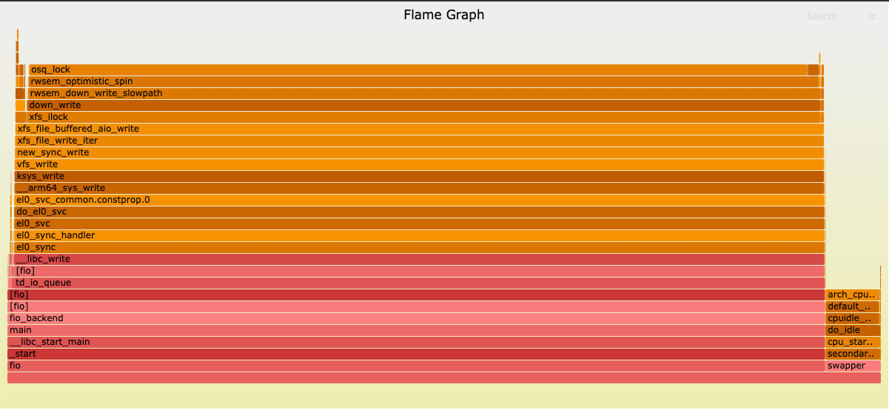

# Debugging performance — “What part of the code is slow?”

[Graviton Performance Runbook toplevel](./graviton_perfrunbook.md)

If after checking the system behavior with the sysstat tools the behavior of your code on the CPU is still different, then your next step is to generate code profiles. There are two primary types of profiles 

## On-cpu profiling

If you see that Graviton is consuming more CPU-time than expected, on-cpu profiling can help find what is taking more time.  On-cpu profiling statistically measures what code is consuming time on the CPU by periodically sampling stack traces on the SUT.  We provide a utility to collect CPU profiles and emit a flamegraph, which is a graphical representation to show the percentage of execution time consumed by a particular stack-trace.  The x-axis represents percentage of execution time, and the y-axis is stack depth. These are particularly useful for finding differences in function execution times between two platforms.  To collect flamegraphs of on-cpu profiling, do the following:

1. Verify native code is built with `-g -fno-omit-frame-``pointer`
2. Verify java code is started with `-XX:+PreserveFramePointer -agentpath:/usr/lib64/libperf-jvmti.so`
3. Verify NodeJS code is started with `--perf-basic-prof`
4. Collect the Flamegraph
  ```bash
  # In terminal one on SUT/load-gen
  %> <start load generator or benchmark>
    
  # In terminal two on SUT
  cd ~/aws-graviton-getting-started/perfrunbook/utilities
  sudo ./capture_flamegraphs.sh oncpu 300
    
  # You will see a file saved in the following format:
  # flamegraph_oncpu_<instance id>_<instance type>_<date>.svg
    
  # In terminal three on your local machine
  %> scp "<username>@<instance-ip>:~/flamegraph_oncpu_*.svg" .
  %> open /path/to/flamegraph_oncpu_*.svg
  ```
5. Example on-cpu flamegraph:
   
1. Look for the most expensive functions and then compare with a flamegraph gathered from the x86 test system.
2. If you find an expensive function that is not expensive on your x86 system, proceed to [Section 6](./optimization_recommendation.md) for Optimization recommendations.

### On-cpu profiling using Psuedo Non-maskable-interrupts (NMI)

If your on-cpu profiling reveals the hot code is in the kernel, you may see issues with measuring code-paths that run in non-preemptible sections of Linux.  This usually manifests as small functions such as `arch_local_irq_restore` in the kernel showing high overhead.  Functions like this are un-masking interrupts, such as the interrupt `perf` uses to trigger taking a sample stack trace, and since the interrupt may have
already been queued, `perf` will record IRQ unmasking functions as hot because that is when IRQs are re-enabled.  To collect profiles of kernel functions that are inside interrupt masked portions of code on Graviton you can enable `perf` to use a pseudo Non-maskable-interrupt to measure inside non-preemptible regions. To enable this, do the following:

1. Ensure `CONFIG_ARM64_PSEUDO_NMI` is enabled in your kernel configuration
2. Enable `irqchip.gicv3_pseudo_nmi=1` on the kernel command line and reboot.
3. Collect a Flamegraph:
  ```bash
  # In terminal on SUT
  cd ~/aws-graviton-getting-started/perfrunbook/utilities
  # Use a custome event from the PMU such as r11 (cycles) or r8 (instructions)
  sudo ./capture_flamegraphs.sh r11 300
  ```
4. Double check you are using a PMU hardware-event, if you do not see a change in your profiles. Events that do not come from the cpu PMU, such as `cpu-clock`, can not utilize the pseudo-NMI feature on Graviton.
5. Be aware code using hardware events such as cycles (r11) will under-count idle time as Graviton uses a clock-gated sleep state during idle on Linux, meaning hardware events will not tick. 

You may see a small single-digit percent increase in overhead with pseudo-NMI enabled, but this is expected.  We recommend only turning on pseudo-NMI when needed.

## Off-cpu profiling

If Graviton2 is consuming less CPU-time than expected, it is useful to find call-stacks that are putting *threads* to sleep via the OS.  Lock contention, IO Bottlenecks, OS scheduler issues can all lead to cases where performance is lower, but the CPU is not being fully utilized.   The method to look for what might be causing more off-cpu time is the same as with looking for functions consuming more on-cpu time: generate a flamegraph and compare.  In this case, the differences are more subtle to look for as small differences can mean large swings in performance as more thread sleeps can induce milli-seconds of wasted execution time.  

1. Verify native (i.e. C/C++/Rust) code is built with `-fno-omit-frame-``pointer`
2. Verify java code is started with `-XX:+PreserveFramePointer -agentpath:/path/to/libperf-jvmti.so`
    1. The `libperf-jvmit.so` library is usually provided when `perf` is installed.  If it is not, see [how to build the jvmti from source](https://github.com/aws/aws-graviton-getting-started/blob/main/java.md#build-libperf-jvmtiso-on-amazon-linux-2) in our getting-started guide.
    2. Additional debugging information can be extracted by adding `-XX:+UnlockDiagnosticVMOptions -XX:+DebugNonSafepoints` to the java command line.
3. Verify NodeJS code is started with `--perf-basic-prof`
4. Collect the Flamegraph:
  ```bash
  # In terminal one on SUT/load-gen
  %> <start load generator or benchmark>
    
  # In terminal two on SUT
  cd ~/aws-graviton-getting-started/perfrunbook/utilities
  sudo ./capture_flamegraphs.sh offcpu 300
    
  # You will see a file saved in the following format:
  # flamegraph_oncpu_<instance id>_<instance type>_<date>.svg
    
  # In terminal three on your local machine
  %> scp "<username>@<instance-ip>:~/flamegraph_oncpu_*.svg" .
  %> open /path/to/flamegraph_offcpu.svg
  ```
5. Inspect the flamegraphs for which code paths cause extra sleeps compared to x86:
    1. Look at sleeps induced by to IO like `read`, `write`, and `epoll` system calls, do they happen more often?
    2. Look at sleeps induced by callpaths that contain keywords such as: `lock`, `mutex`, `semaphore`, `synchronize`, `futex`. Determine if these are happening more often than on x86.
    3. Disregard call-stacks that include `work_pending`. These indicate the CPU was involuntarily switched and can be ignored.
6. If you find that there are code paths that are sleeping more than expected, proceed to [Section 6 for Optimization recommendations](./optimization_recommendation.md).

## Additional profiling tips

In our `capture_flamegraphs.sh` helper script, we use `perf record` to gather traces.  The script can be modified to collect different views of the same data to help dig deeper and root cause the reason for a detected performance issue on Graviton.

1. To aide in spotting differences between two flamegraphs, you can use a flamegraph diff between `perf` data on x86 and Graviton
  ```bash
  # On load generation instance
  %> <start test>
    
  # x86 SUT
  perf record -a -g -k 1 -F99 -e cpu-clock:pppH -- sleep
  perf script -f -i perf.data > x86_script.out
  ./FlameGraph/stackcollapse-perf.pl --kernel --jit x86_script.out > x86_folded.out
    
  # Graviton SUT
  perf record -a -g -k 1 -F99 -e cpu-clock:pppH -- sleep
  perf script -f -i perf.data > grv_script.out
  ./FlameGraph/stackcollapse-perf.pl --kernel --jit grv_script.out > grv_folded.out
  # Copy x86_folded.out to Graviton SUT
  ./Flamegraph/difffolded.pl grv_folded.out x86_folded.out > diff.out
  ./Flamegraph/flamegraph.pl --colors java diff.out > flamegraph-diff.svg
  ```
2. View the diff — red regions indicate an increase in the proportion of execution time, blue a decrease. Note: diffing call-stacks between different architectures can lead to peculiar artifacts due to machine specific functions being named differently.
3. Create flame-graphs from `perf record`  that use different events than the cpu-clock to determine when to sample stack traces. This can help uncover different root causes and potential optimization opportunities.  Examples below:
    1. Use `-e instructions` to generate a flame-graph of the functions that use the most instructions on average to identify a compiler or code optimization opportunity.
    2. Use `-e cache-misses` to generate a flame-graph of functions that miss the L1 cache the most to indicate if changing to a more efficient data-structure might be necessary.
    3. Use `-e branch-misses` to generate a flame-graph of functions that cause the CPU to mis-speculate.  This may identify regions with heavy use of conditionals, or conditionals that are data-dependent and may be a candidate for refactoring.

