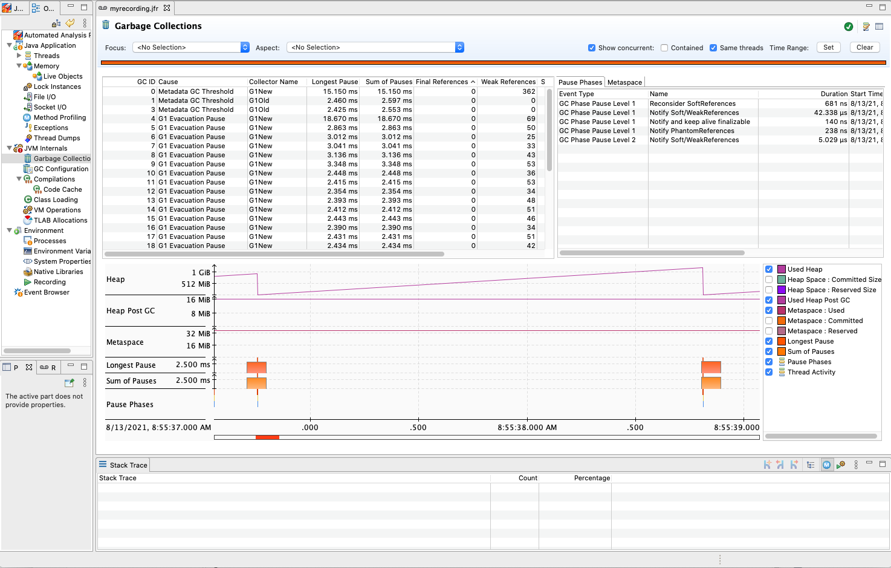

# Debugging performance — “What part of the system is slow?”

[Graviton Performance Runbook toplevel](./graviton_perfrunbook.md)

When debugging performance, start by measuring high level system behavior to pinpoint what part of the system performs differently when compared with a control instance.  Are the CPUs being saturated or under-saturated?  Is the network or disk behaving differently than expected?  Did a mis-configuration creep in that went undetected when validating the SUT application setup?

## Check CPU-usage

1. Check the `cpu-iowait` time. High `cpu-iowait` indicates a bottleneck in disk operations. In this case, provision EBS volumes with more IOPs or use local disk instances to determine if the Graviton CPU is performing faster. Otherwise, high iowait time will lead to performance results that are similar between instances since disk operations, not CPU performance, is the bottleneck.
  ```bash
  # Terminal one
  %> <start load generator or benchmark>
    
  # Terminal two
  %> cd ~/aws-gravition-getting-started/perfrunbook/utilities
  %> python3 ./measure_and_plot_basic_sysstat_stats.py --stat cpu-iowait --time 60
  ```
2. Check the `cpu-user` and `cpu-kernel` time at your chosen load point. Check to see if Graviton2 has higher or lower cpu time  than the x86 comparison system-under-test.  
  ```bash
  # Terminal one
  %> <start load generator or benchmark>
    
  # Terminal two
  %> cd ~/aws-gravition-getting-started/perfrunbook/utilities
  %> python3 ./measure_and_plot_basic_sysstat_stats.py --stat cpu-user --time 60
  # To get kernel time, do cpu-kernel
    
  # Example output
  100 ++-----------------------+------------------------+------------------------+------------------------+------------------------+-----------------------++
      + ***       ***       ***+   *********         *******                     *** ****           **** ****           ****       +                      * +
      **   *******   *******   ****          ********       *  ***********      *   *    *****     *    *    *        **    ******    ***************    *  |
      |                                     *                **                *              *   *           *     **            *  *               *   *  |
      |                                                                   ** **                * *             *** *              * *                 * *   |
      |                                                                     *                   *                 *                *                   *    |
      |                                                                                                                                                     |
   80 ++                                                                                                                                                   ++
      |                                                                                                                                                     |
      |                                                                                                                                                     |
      |                                                                                                                                                     |
      |                                                                                                                                                     |
      |                                                                                                                                                     |
   60 ++                                                                                                                                                   ++
      |                                                                                                                                                     |
      |                                                                                                                                                     |
      |                                                                                                                                                     |
      |                                                                                                                                                     |
      |                                                                                                                                                     |
      |                                                                                                                                                     |
   40 ++                                                                                                                                                   ++
      |                                                                                                                                                     |
      |                                                                                                                                                     |
      |                                                                                                                                                     |
      |                                                                                                                                                     |
      |                                                                                                                                                     |
   20 ++                                                                                                                                                   ++
      |                                                                                                                                                     |
      |                                                                                                                                                     |
      |                                                                                                                                                     |
      |                                                                                                                                                     |
      |                                                                                                                                                     |
      +                        +                        +                        +                        +                        +                        +
    0 ++-----------------------+------------------------+------------------------+------------------------+------------------------+-----------------------++
      0                        10                       20                       30                       40                       50                       60
                                                                             Time (s)
3. If CPU usage is higher or equal to the x86 system, proceed to profile for hot-functions in [Section 5.b](./debug_code_perf.md).
4. If CPU usage is lower, proceed to [Section 5.b](./debug_code_perf.md) to profile which functions are putting threads to sleep and causing the CPU to go idle more than the x86 system.

## Check system memory usage

It is also advisable to check memory consumption using `sysstat -r ALL` or `htop`.  Verify the system is not under memory pressure during testing. 

## Check network usage

1. Check for bursts of connections coming from the load-generator using
  ```bash
  # On load-generator
  %> <start test>
    
  # On SUT
  %> cd ~/aws-gravition-getting-started/perfrunbook/utilities
  %> python3 ./measure_and_plot_basic_sysstat_stats.py --stat new-connections --time 60
  ```
2. If seeing bursts, verify this is expected behavior for your load generator.  Bursts can cause performance degradation on Graviton2 if each new connection has to do an RSA signing operation for TLS connection establishment.
3. Check on SUT for hot connections (connections that are more heavily used than others) by running: `watch netstat -t`
4. The example below shows the use of `netstat -t` to watch TCP connections with one being hot as indicated by its non-zero `Send-Q` value while all other connections have a value of 0. This can lead to one core being saturated by network processing on the SUT, bottlenecking the rest of the system.  
  ```bash
  %> watch netstat -t
      Every 2.0s: netstat -t
      ip-172-31-9-146: Tue Jan 12 23:01:35 2021
        
      Active Internet connections (w/o servers)
      Proto Recv-Q Send-Q Local Address           Foreign Address         State
      tcp        0      0 ip-172-31-9-146.ec2:ssh 72-21-196-67.amaz:62519 ESTABLISHED
      tcp        0 345958 ip-172-31-9-146.ec2:ssh 72-21-196-67.amaz:25884 ESTABLISHED
      tcp        0      0 ip-172-31-9-146.ec2:ssh 72-21-196-67.amaz:18144 ESTABLISHED
  ```
5. Go back and verify the load generator is providing the expected traffic.
6. Check `sar -n DEV 1` to see throughput and packets per second, and overall packet rate the system is getting per device. Check and verify you are not hitting ENA throttles. 
7. [Metrics in cloudwatch](https://docs.aws.amazon.com/AWSEC2/latest/UserGuide/monitoring-network-performance-ena.html): `bw_in_allowance_exceeded`, `bw_out_allowance_exceeded`, `conntrack_allowance_exceeded`, `linklocal_allowance_exceeded`, `pps_allowance_exceeded` for your instances can be inspected to see if networking throttles are being hit.  If they are, your network is the botteneck and should be increased.
8. If hitting ENA throttles, provision a larger instance to get more bandwidth if possible.  IO bottlenecks tend to mask any CPU performance gains.

## Check Runtime behavior

Checking how your chosen runtime is behaving should be done before moving on to more in depth studies. Basic runtime tunables such as Garbage Collection need to be checked to ensure there is no unexpected behavior. We describe how to perform such standard checks for the Java runtime in the following.  Below we describe how to perform some standard checks for the Java runtime.  We are not able to provide recommended tools or methodologies for checking high level behavior of other popular runtimes such as Python or NodeJS at the moment.

### Java Runtime

When running Java applications, monitor for differences in behavior using JFR (Java Flight Recorder) to record JVM behavior and view with JMC (Java Mission Control). These can expose different execution behaviors as reasons for performance differences.

1. Enable a JFR recording for your application by adding `-XX:+FlightRecorder -XX:StartFlightRecording=delay=<X>s,duration=<X>s,name=<name>,filename=path/to/recording.jfr` to the JVM command line.
    1. Get [Java Mission Control](https://www.oracle.com/java/technologies/javase/products-jmc8-downloads.html)
    2. Download the resulting JFR file to local machine
    3. Open up the JFR file with Mission Control
2. Check for Garbage Collection (GC) behavior
    1. Longer collectionpauses, 
    2. Check if more objects/references are are live between collections compared to x86.
    3. The image below shows JMC’s GC pane, showing pause times, heap size and references remaining after each collection.
    
4. The same information can be gathered by enabling GC logging and then processing the log output. Enter `-Xlog:gc*,gc+age=trace,gc+ref=debug,gc+ergo=trace` on the Java command line and re-start your application.
5. If longer GC pauses are seen, this could be happening because objects are living longer on Graviton2 and the GC has to scan them.  To help debug this gather an off-cpu profile ([see Section 5.b](./debug_code_perf.md)) to look for threads that are sleeping more often and potentially causing heap objects to live longer.
6. Check for debug flags that are still enabled but should be disabled, such as: `-XX:-OmitStackTraceInFastThrow` which logs and generates stack traces for all exceptions, even if they are not fatal exceptions.
7. Check there are no major differences in JVM ergonomics between Graviton2 and x86, run:
  ```bash
  %> java -XX:+PrintFlagsFinal -version
  # Capture output from x86 and Graviton2 and then diff the files
  ```

