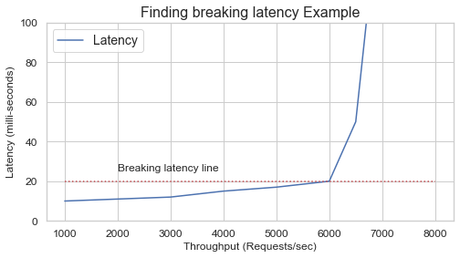

# Defining your benchmark

[Graviton Performance Runbook toplevel](./graviton_perfrunbook.md)

To define a benchmark there are two things to consider, the software running on the System-under-test (SUT) and how to drive load.  We recommend the software running on the SUT should be your production application. There is no better benchmark to predict performance than the actual production code.  If a synthetic proxy must be used to break dependencies of your application on external services such as authentication layers, then that proxy should be derived from the production code as much as possible.  We recommend avoiding synthetic benchmarks not related to the production code.  They are generally poor at predicting performance for another application or helping optimize it as they can over-target specific attributes of a system or exercise different bottlenecks than your application code might.

Once the code to test is selected, the proper traffic load to the SUT must be defined.  There are three primary ways to drive load to measure performance and also to debug performance issues: via a synthetic load generator, live traffic redirection, or live traffic duplication. After determining how to send traffic to your SUT, the next step is to determine the load point for the SUT.  Picking the proper load point will help with evaluating and debugging your application code on Graviton.  For most cases, the proper load point should be what is defined as peak load.  Below we describe two methods to pick the proper load point: the maximum number of operations per second or maximum throughput, and breaking latency.  

## Maximum throughput

Maximum throughput tests the limits of the SUT, with no regard for response latency.  To test maximum throughput, have the load-generator increase load until all vCPUs on the SUT are operating at 100% with as little OS idle time measured as possible. This can be verified by using `sysstat` or  `htop` to see CPU utilization and by measuring at what settings on the load generator achieve the maximum score. If reaching 100% CPU utilization on the SUT is not possible, then find the peak throughput point reported with the load generator and record the settings used. If there are any bottlenecks present, they will be magnified when running at maximum throughput. After each optimization attempted, the maximum throughput point will have to re-evaluated.

## Throughput at breaking latency

If latency and throughput have to be balanced, then a different methodology is needed.  In this case it is important to look for the breaking latency.  Breaking latency is the point when the machine can no longer serve more throughput and maintain acceptable response times to the load-generator and incrementally more throughput induces an exponential rise in latency.  An example of that exponential rise is below.

To find breaking latency, configure the load-generator to incrementally increase load while measuring latency and/or response failures to find the knee point in the latency/failure/throughput curve before it starts an exponential rise indicating the saturation point of the SUT. This usually requires a binary or linear search to refine where this point is located for each SUT.  Once these points are found, compare them and continue to use them for further experiments and debugging. After each successive optimization attempted, the saturation throughput point will have to be re-evaluated, and the goal is to shift the curve down and to the right, indicating more throughput and lower latency.

## Synthetic load generators

If you choose to use a synthetic load generator to drive your application, but need help finding a good candidate to use, please see the [Appendix](./appendix.md) to learn about the types of load generators and what we recommend to use.

With your benchmark fully defined, it is now time to move on to [Section 3](./configuring_your_loadgen.md), and start verifying the test environment and accounting for any variables present. 
