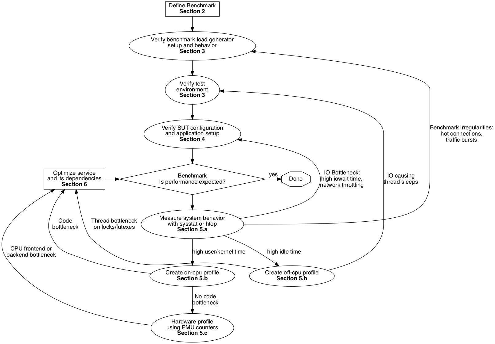

# Graviton Performance Runbook

## Introduction

This document is a reference for software developers who want to benchmark, debug, and optimize their application code on AWS Graviton based instances.  It contains checklists, best practices, examples, and tooling collected by the EC2 Graviton team to assist with the tasks of benchmarking, debugging, or optimizing code on Graviton.

This document covers many topics from how to benchmark, debugging performance and optimization recommendations.  It is not meant to be read beginning-to-end. Instead view it as a collection of checklists and best known practices to apply when working with Graviton instances that go progressively deeper into analyzing the system.  Please see the FAQ below to direct you towards the most relevant set of checklists and tools depending on your specific situation.

If after following these guides there is still an issue you cannot resolve with regards to performance on Graviton2, please do not hesitate to raise an issue on the [AWS-Graviton-Getting-Started](https://github.com/aws/aws-graviton-getting-started/issues) guide or contact us at [ec2-arm-dev-feedback@amazon.com](mailto:ec2-arm-dev-feedback@amazon.com).  If there is something missing in this guide, please raise an issue or better, post a pull-request.

## Pre-requisites

To assist with some of the tasks listed in this runbook, we have created some helper-scripts for some of the tasks the checklists describe.  The helper-scripts assume the test instances are running an up-to-date AL2 or Ubuntu 20.04LTS distribution and the user can run the scripts using `sudo`. Follow the steps below to obtain and install the utilities on your test systems:

```bash
# Clone the repository onto your systems-under-test and any load-generation instances
git clone https://github.com/aws/aws-graviton-getting-started.git
cd aws-graviton-getting-started/perfrunbook/utilities

# On AL2
sudo ./install_perfrunbook_dependencies_al2.sh
# On Ubuntu
sudo ./install_perfrunbook_dependencies_ubuntu2004.sh

# All scripts expect to run from the utilities directory
```

## Sections

1. [Introduction to Benchmarking](./intro_to_benchmarking.md)
2. [Defining you benchmark](./defining_your_benchmark.md)
3. [Configuring your load generator](./configuring_your_loadgen.md)
4. [Configuring your system-under-test environment](./configuring_your_sut.md)
5. Debugging Performance
    1. [Debugging performance — “What part of the system is slow?”](./debug_system_perf.md)
    2. [Debugging performance — “What part of the code is slow?”](./debug_code_perf.md)
    3. [Debugging performance — “What part of the hardware is slow?”](./debug_hw_perf.md)
6. [Optimizing performance](./optimization_recommendation.md)
7. [Appendix — Additional resources](./appendix.md)
8. [References](./references.md)

## FAQ

* **I want to benchmark Graviton but I have yet to port my application, where do I find information on helping port my application?**
    Our getting-started-guide has many resources to help with porting code to Graviton for a number of programming languages.  Start by reading those guides to understand minimum runtime, dependency and language requirements needed for Graviton.
* **What benchmark should I run to determine if my application will be a good fit on Graviton?**
    No synthetic benchmark is a substitute for your actual production code.  The best benchmark is running your production application on Graviton with a load that approximates your production load.  Please refer to [Section 1](./intro_to_benchmarking.md) and [2](./defining_your_benchmark.md) on how to benchmark and on selecting a benchmark for more details.
* **I ran micro-benchmark X from github project Y and it shows Graviton has worse performance, does that mean my application is not a good fit?**
    No.  Benchmarks only tell a limited story about performance, and unless this particular benchmark has been vetted as a good indicator for your application’s performance, we recommend running your production code as its own benchmark.  For more details, refer to [Section 1](./intro_to_benchmarking.md) and [2](./defining_your_benchmark.md) on how to define experiments and test Graviton for your needs.
* **I benchmarked my service and performance on Graviton is slower compared to my current x86 based fleet, where do I start to root cause why?**
    Begin by verifying software dependencies and verifying the configuration of your Graviton and x86 testing environments to check that no major differences are present in the testing environment.  Performance differences may be due to differences in environment and not the due to the hardware.  Refer to the below chart for a step-by-step flow through this runbook to help root cause the performance regression:
    
* **What are the recommended optimizations to try with Graviton2?**
    Refer to [Section 6](./optimization_recommendation.md) for our recommendations on how to make your application run faster on Graviton.
* **I investigated every optimization in this guide and still cannot find the root-cause, what do I do next?**
    Please contact us at [ec2-arm-dev-feedback@amazon.com](mailto:ec2-arm-dev-feedback@amazon.com) or talk with your AWS account team representative to get additional help.

