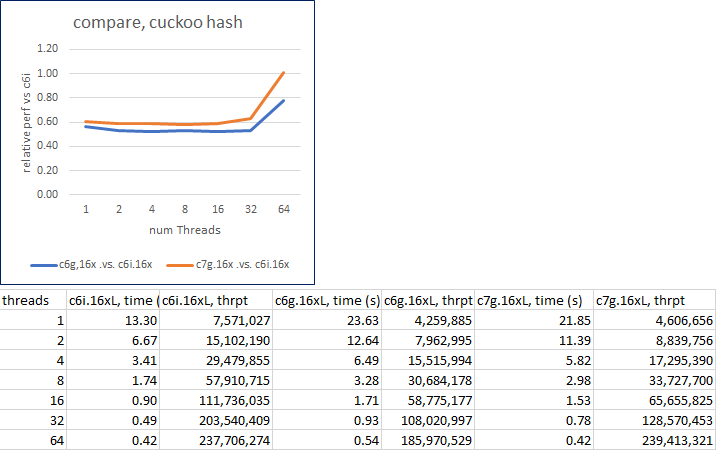

# System Load and Compute Headroom

From an economical perspective compute resources should be utilized fully.
Ideally the system's performance should increase linearly up to 100% CPU load.
This can be in the context of pure compute or peak load and fail-over resilience.
Graviton instances and x86-type instances, such as c6i, behave fundamentally different under load.
Any initial x86 advantage over Graviton starts to disappear beyond 50% system load.
This effect is caused by symmetric multithreading and the Linux kernel's preferrence of CPU cores over CPU threads.
In the following this behavior is investigated with a few illustrative workloads.

### Experimental Setup

The test systems are limited to eight cores to limit the maximum packet load needed to saturate them. 
This is to exclude the influence of the networking infrastructure on the experiment.
All systems run Amazon Linux 2 with Linux kernel 5.10.118.
The test system are virtualized instances that use S3 networked storage.


#### First experiment

The systems to be tested are an 8 vCPU Intel instance (8375C, 3.5GHz), c6i.2xlarge, and an 8 CPU Graviton 3 instance, c7g.2xlarge.
OpenSSL source is placed and configured in eight separate directories.
The test then compiles OpenSSL one to eight times in parallel, limited to one CPU per compile.
An ideal system would take the exact same time for each compile run.

Results:

The Graviton 3 achieves 96% of the single compile time performance, single CPU baseline when using 100% of the available CPUs.
The Intel system achieves 63% of the compile time performance of the single compile, single CPU baseline when loaded to 100%.


Note: 
The average compile time of the c6i instance is 268s, close to the 250s on c7g. 
The Linux scheduler picks cores over threads, when available, which shows nicely in the steep increase in compile time of the c6i beyond 50% load.

#### Second experiment

The second experiment adds a 64 core Graviton 3, c7g.16xlarge, that serves as a load generator running wrk2.
Test systems are an 8 CPU c7g.2xlarge Graviton 2 and an 8 vCPU c6i.2xlarge Intel x86/SMT (8375C).
Here a simple HTTP server, implemented using the Netty/Java framework, is the workload on the systems under test.
Latency vs actual packets processed is captured alongside the CPU load of the systems, as reported by /proc/stat.
Of particular interest is the performance at 50% and at maximum sustained load.
Maximum sustained load is where the response latency is no longer than two times the response time at <20% CPU load.
This is the reason why the tables below stop at 96% and 94% respectively.

Results:

```
Graviton 3, c7g.2xlarge, 8 CPUs
Requests/s, CPU use [%], Latency [us]
49336, 9, 1142
99040, 15, 1181
147919, 23, 1172
197237, 22, 1178
247393, 35, 1224
296473, 46, 1267
346105, 55, 1321
394972, 63, 1356
445239, 72, 1395
493953, 79, 1407
544111, 84, 1465
593242, 88, 1512
640886, 93, 1531
687339, 97, 1556
736860, 99, 1917
```


For this workload, the non-SMT Graviton 3 system performs better than linear:
296473/0.46=644506 packet/s would be expected as maximum throughput. 736860/644506=1.14, thus 14% better than expected.

```
Intel SMT System, c6i.2xlarge, 8 vCPUs

Requests/s, CPU use [%], Latency [us]
49516, 7, 1005
99047, 17, 977
148205, 21, 975
197231, 31, 918
247118, 35, 960
297056, 41, 957
345138, 50, 1037
395424, 60, 1037
443433, 70, 1106
493272, 81, 1173
543327, 88, 1301
591411, 94, 1806

```


The Intel SMT system degrades when loaded close to 100%. It achieves 86% of the performance it should have shown based on the 50% number: 345138/0.50=690276 packet/s would be expected. Thus 591411/690276=0.857 of the predicted value is achieved.
At the 50% CPU load mark, a c6i can handle an additional 71% of the traffic it did up to 50% (345k,246k), whereas the c6g is able to serve another 130% of that (314k,423k).

#### Third Experiment

These are the results of a hashing benchmark that initially favor c6i instances:



Of interest here is that the initial c6i advantage over c7g starts to disappear beyond 50% system load. Again, because the Linux kernel will prefer using cores first and resort to SMT threads after 50% load, c6i performance decreases from thereon. The c6g and c7g instances performance increases linearly. Here,  a c7g instance performs at the same level as c6i at 100% CPU load.

#### Discussion

In the first experiment, for the c6i to maintain the same response time as the c7g, it would need more vCPUs. It can stay on par until 5 of the 8 vCPUs are used. 
In the second experiment, the c6i would need 2 additional vCPUs to be on par with c7g in packets/s.
The third experiment shows that the c6i has an advantage in processing speed when the system is loaded below 50%. 
Experiment one and two also indicate this, if not as clearly.


#### Conclusions

Graviton instances compute performance increases linear with CPU load, x86 performance increases less after 50% CPU load. This is because x86-type CPUs employ symmetric multithreading, aka. 'Hyperthreading'. Based on the above, load balancer thresholds can, in many cases, be set higher on Graviton instances than on x86-type instances and thus lead to significant savings in the size of the required server fleet, as the Netty example shows. 
Since every workload has different demands on the system, a full load sweep should done to determine best system type and at which threshold additional instances need to be added to maintain performance.

