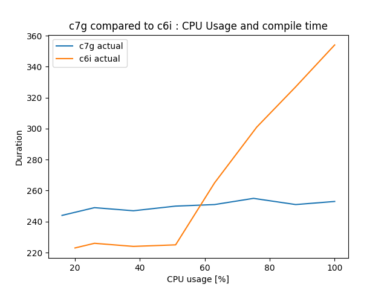
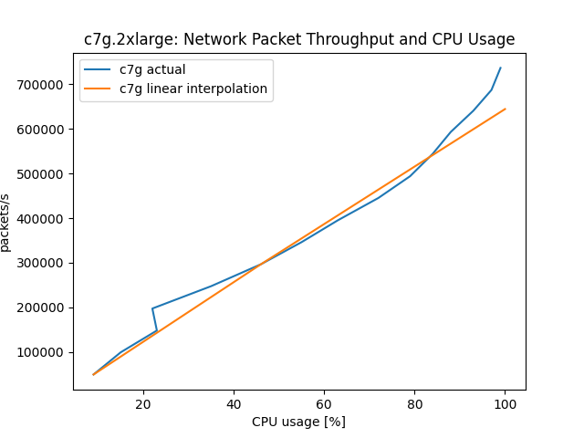
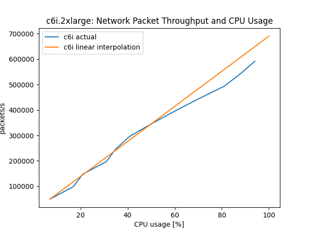

# System Load and Compute Headroom

Ideally, a system's performance should scale linearly as more vCPUs are used, up to 100% CPU load.
This ideal is not always realized due to how vCPUs are implemented on x86 and Graviton based EC2 instances.
Our x86 based EC instances in AWS EC2 execute two hardware threads per core, each thread representing a vCPU.
Graviton processors can execute only one hardware thread, or vCPU, per physical core.
The Linux kernel schedules tasks to cores first, then, when all physical cores are used, to hardware threads.
When hardware threads have to share one physical core, the per-thread performance decreases significantly.
This leads to x86 and Graviton systems to scale differently under increasing CPU load.
We recommend to always load test your application on Graviton to determine the CPU load limits your application
needs to maintain for quality of service, fail-over resilience etc., as they will likely be different between Graviton and x86.
To illustrate how Graviton behaves differently relative to CPU load, we provide two short case-studies below.

### Experimental Setup

The test systems are limited to eight cores to limit the maximum packet load needed to saturate them.
This is to exclude the influence of the networking infrastructure on the experiment.
All systems run Amazon Linux 2 with Linux kernel 5.10.118.
The test system are virtualized instances that use EBS networked storage.

#### First experiment

The systems to be tested are an 8 vCPU Intel instance, c6i.2xlarge, and an 8 vCPU Graviton 3 instance, c7g.2xlarge.
OpenSSL source is placed and configured in eight separate directories.
The test then compiles OpenSSL one to eight times in parallel, limited to one vCPU per compile.
An ideal system would take the exact same time for each compile run.

Results:

The Graviton 3 achieves 96% of the single compile time performance, single CPU baseline when using 100% of the available CPUs.
The Intel system achieves 63% of the compile time performance of the single compile, single CPU, baseline when loaded to 100%.

Note:
The average compile time of the c6i instance is 268s, close to the 250s it took on c7g.
The Linux scheduler picks cores over threads, when available, which shows nicely in the steep increase in compile time of the c6i beyond 50% load.
For the c6i to maintain the same response time as the c7g, it would need more vCPUs. It can stay on par until 5 of the 8 vCPUs are used.

#### Second experiment

The second experiment adds a 64 core Graviton 3, c7g.16xlarge, that serves as a load generator running wrk2.
Test systems are an 8 CPU c7g.2xlarge Graviton 3 and an 8 vCPU c6i.2xlarge Intel Xeon.
Here a simple HTTP server, implemented using the Netty/Java framework, is the workload on the systems under test.
Latency vs actual packets processed is captured alongside the CPU load of the systems, as reported by /proc/stat.
Of particular interest is the performance at 50% and at maximum sustained load.
Maximum sustained load is where the response latency is no longer than two times the response time at <20% CPU load.
This is the reason why the plots stop shy of 100%.

Results:

For this workload, the non-SMT Graviton 3 system performs better than linear:
644506 packet/s would be expected as maximum throughput but 736860 packets/s where handled, thus 14% better than expected.

The Intel SMT system degrades when loaded close to 100%. It achieves 86% of the performance it should have shown, based on the 50% number: 690276 packet/s would be expected, 591411 packets/s where actually handled.
At the 50% CPU load mark, a c6i can handle an additional 71% of the traffic it did up to 50% (345k,246k), whereas the c7g is able to serve another 130% of that (314k,423k).
The c6i would need 2 additional vCPUs to be on par with c7g in packets/s.

#### Conclusion

Graviton instances compute performance increases near-linearly with CPU load, x86 performance increases less after 50% CPU load. This is because our x86 based EC2 instances employ symmetric multithreading, aka. 'Hyperthreading'. Based on the above, load balancer thresholds can, in many cases, be set higher on Graviton instances than on x86-type instances and thus lead to significant savings in the size of the required server fleet, as the Netty example shows.
Since every workload has different demands on the system, a full load sweep should done to determine best system type and at which threshold additional instances need to be added to maintain performance.

